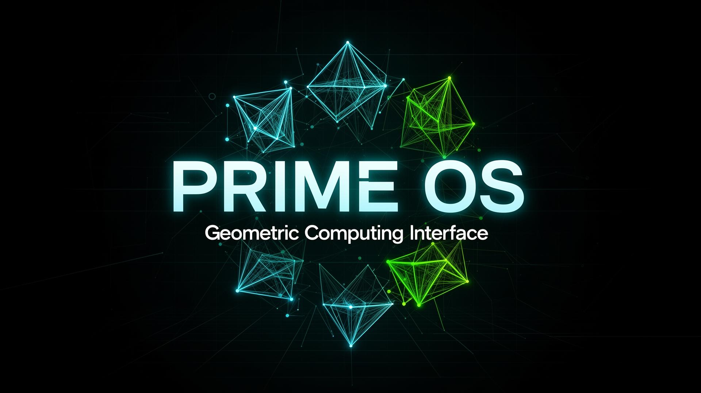
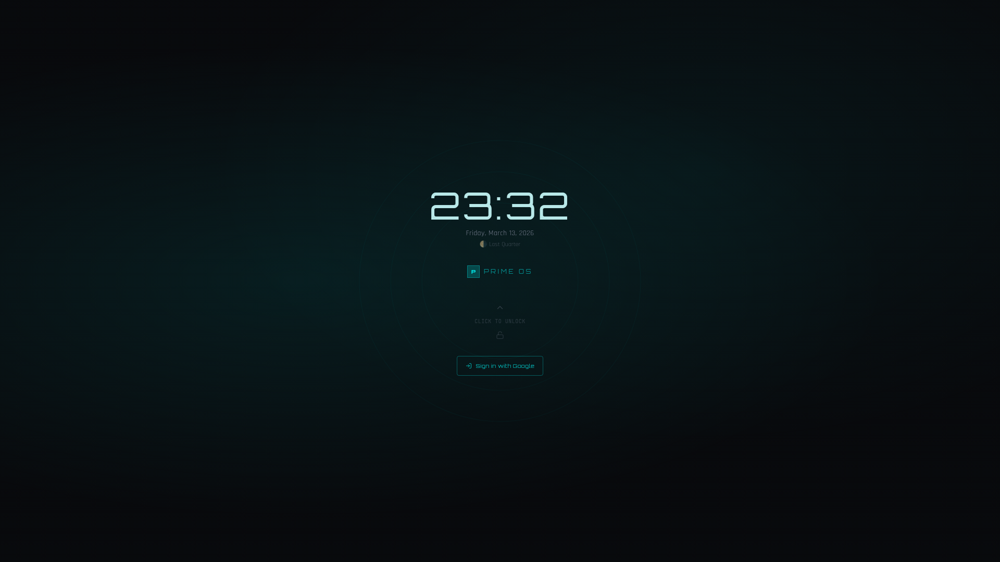
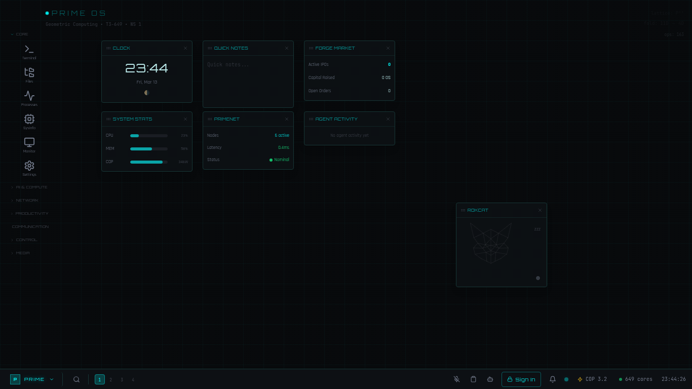
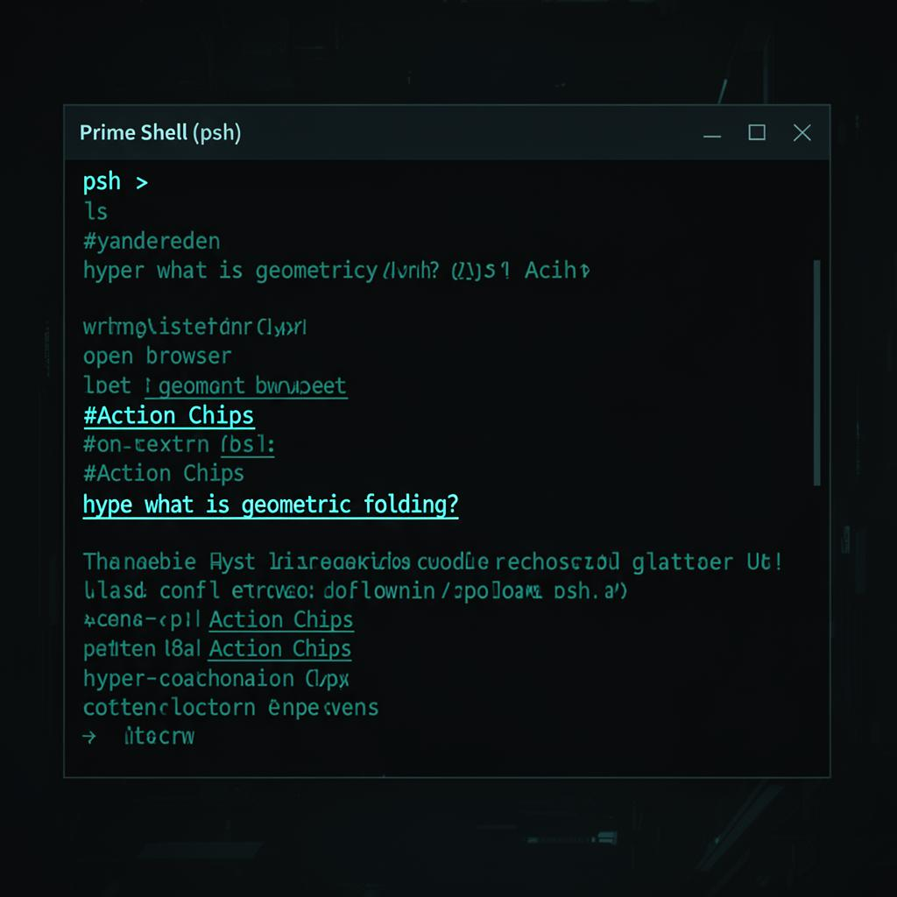
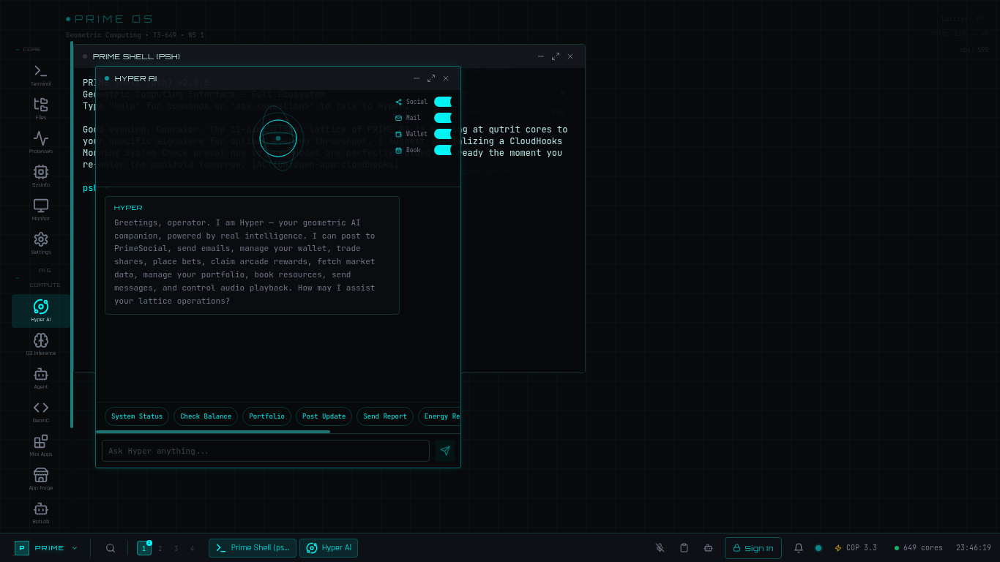

# PRIME OS

[](https://www.typescriptlang.org/)
[](https://react.dev/)
[](https://tailwindcss.com/)
[](https://vitejs.dev/)
[](https://lovable.dev/products/prime-web-dream)

> **[🔴 Live Demo → os.rlgix.com](https://os.rlgix.com)**



**Geometric Computing Interface** — Built by [Rocket Logic Global](https://rocketlogicglobal.com)

PRIME OS is a browser-based operating system exploring geometric computation, ternary logic, and 11-dimensional folding architectures. It provides a fully interactive desktop environment with 50+ specialized applications, AI integration, and a cloud-powered backend.

---

## 🖥️ Screenshots

### Lock Screen


### Desktop Environment


### Terminal (Prime Shell)


### ROKCAT — AI Companion with Action Chips


---

## ✨ Highlights

- **Full desktop environment** — Windows, taskbar, workspaces, drag/resize, snap, global search
- **50+ applications** — Productivity, finance, infrastructure, AI, social, and developer tools
- **AI companion (ROKCAT)** — Chat with Grok, GPT, Claude, or Gemini with persistent memory
- **BYOK** — Bring Your Own Key for xAI, OpenAI, Anthropic, or Google
- **Terminal** — Command-line with pipes, modes, AI shell, and widget commands
- **Action Chips** — AI responses contain clickable app references
- **Mobile support** — Responsive launcher for mobile and tablet
- **Real-time** — Live chat, calendar reminders, system notifications

---

## Architecture

```
┌─────────────────────────────────────────────┐
│                  Browser                     │
├─────────────────────────────────────────────┤
│  LandingPage (/)  │  Desktop (/os)          │
│                   │  ├── LockScreen (Auth)   │
│                   │  ├── BootSequence        │
│                   │  ├── SetupWizard         │
│                   │  ├── Taskbar             │
│                   │  ├── OSWindow[] (50+ apps)│
│                   │  ├── DesktopWidgets      │
│                   │  ├── GlobalSearch        │
│                   │  └── NotificationSystem  │
├─────────────────────────────────────────────┤
│  EventBus (cross-app pub/sub)               │
│  useWindowManager (window state)            │
│  useCloudStorage (localStorage + DB sync)   │
├─────────────────────────────────────────────┤
│  Supabase Backend                           │
│  ├── 30+ database tables (RLS)             │
│  ├── 16 edge functions (Deno)              │
│  ├── File storage (user-files bucket)      │
│  └── Auth (Google OAuth)                    │
└─────────────────────────────────────────────┘
```

---

## Tech Stack

| Layer | Technology |
|---|---|
| Frontend | React 18 + TypeScript + Vite |
| Styling | Tailwind CSS + shadcn/ui |
| State | React hooks + EventBus singleton |
| Data Viz | Recharts |
| Animation | Framer Motion |
| Icons | Lucide React |
| 3D | Three.js |
| Backend | Supabase (Postgres + Edge Functions) |
| Auth | Google OAuth via Supabase Auth |

---

## 🚀 Deploy Your Own

The fastest way to get your own PRIME OS instance running:

### Option 1: Clone via Lovable (Recommended)

1. **Click the badge** below to clone the project directly into your Lovable workspace:

   [](https://lovable.dev/products/prime-web-dream)

2. Lovable will create a full copy with backend, database, and edge functions pre-configured
3. Navigate to `/os` in your preview to enter the desktop
4. **Configure AI** (optional): Open Settings → AI Keys to add your own API keys for xAI, OpenAI, Anthropic, or Google
5. **Configure Auth** (optional): Set up Google OAuth in your project's backend settings for user sign-in
6. **Publish**: Click the Publish button to deploy your instance to a live URL

### Option 2: Manual Setup

```sh
# Clone the repository
git clone <YOUR_GIT_URL>
cd <YOUR_PROJECT_NAME>

# Install dependencies
npm install

# Start the dev server
npm run dev
```

Open `http://localhost:5173` and navigate to `/os`.

For manual Supabase setup, see [Getting Started](./docs/GETTING_STARTED.md) for environment variables, database migrations, and edge function deployment.

---

## Features

### Desktop Environment
Windowed multitasking with taskbar, 4 workspaces, context menus, global search (Ctrl+K), and notification system.

### AI Integration
BYOK support for xAI (Grok), OpenAI, Anthropic, and Google Gemini. ROKCAT AI companion with persistent memory and interactive Action Chips.

### Applications (50+)
- **Productivity** — Terminal, Files, Calendar, Mail, Docs, Editor, Grid, Canvas, Journal, Board
- **AI & Bots** — ROKCAT, Hypersphere, BotLab, AppForge, Mini Apps
- **Finance** — Wallet, Vault, Bets, Signals
- **Social** — PrimeSocial, PrimeChat, PrimeComm, PrimeLink
- **Infrastructure** — System Monitor, Security Console, Data Center, Cloud Hooks, Energy Monitor
- **Developer** — PrimeGit (GitHub integration), SchemaForge, PrimePkg
- **Lore** — Q3 Inference, FoldMem, PrimeNet, PrimeRobotics, PrimeIoT

### Terminal
Full command-line interface with pipes (`|`), modes (`hacker`, `retro`, `matrix`), AI shell (`hyper <prompt>`), and widget commands.

### Mobile
Responsive launcher for mobile and tablet with full-screen app rendering.

---

## Documentation

Full internal documentation is available in the [`docs/`](./docs/README.md) directory:

| Document | Description |
|---|---|
| [Getting Started](./docs/GETTING_STARTED.md) | Setup, structure, and adding new apps |
| [Architecture](./docs/ARCHITECTURE.md) | System flow, window manager, EventBus, auth |
| [Features](./docs/FEATURES.md) | Deep-dives into AI, Action Chips, onboarding, etc. |
| [App Catalog](./docs/APPS.md) | All 50+ apps with backend integration details |
| [Backend Reference](./docs/BACKEND.md) | Database tables, edge functions, secrets |
| [API Reference](./docs/API_REFERENCE.md) | Edge function endpoints, request/response schemas |
| [Hooks Reference](./docs/HOOKS.md) | Custom React hooks |
| [Terminal Reference](./docs/TERMINAL.md) | Commands, pipes, modes |
| [Security Overview](./docs/SECURITY.md) | RLS policies, auth patterns |
| [Contributing](./docs/CONTRIBUTING.md) | Code style, PR workflow, conventions |

---

## Contributing

We welcome contributions! Please read the [Contributing Guide](./docs/CONTRIBUTING.md) before submitting a PR.

---

## License

© Rocket Logic Global. All rights reserved.
